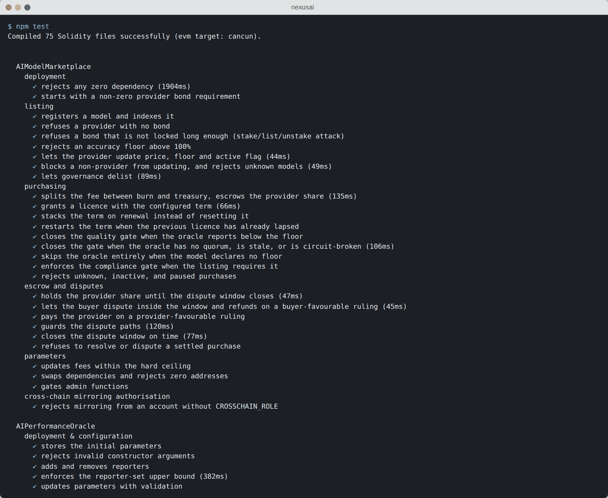
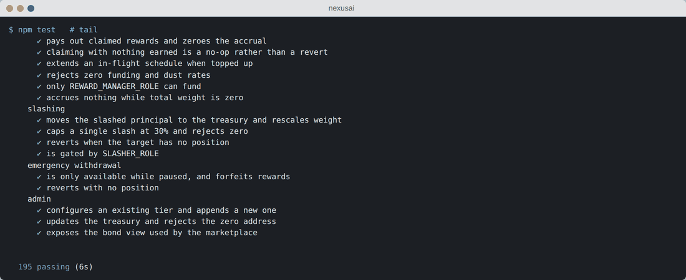
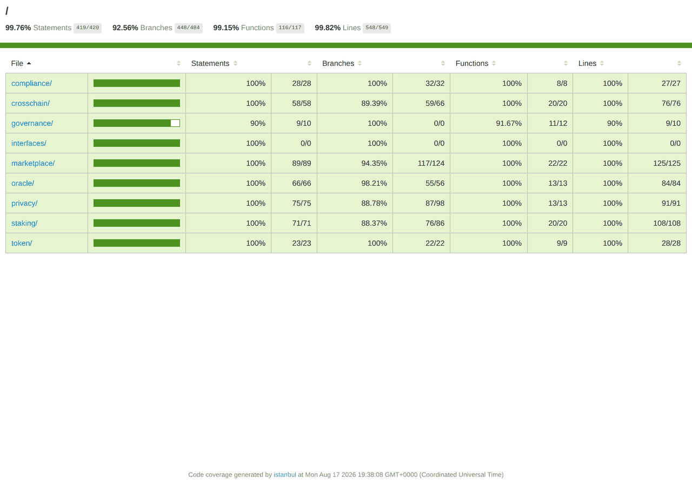
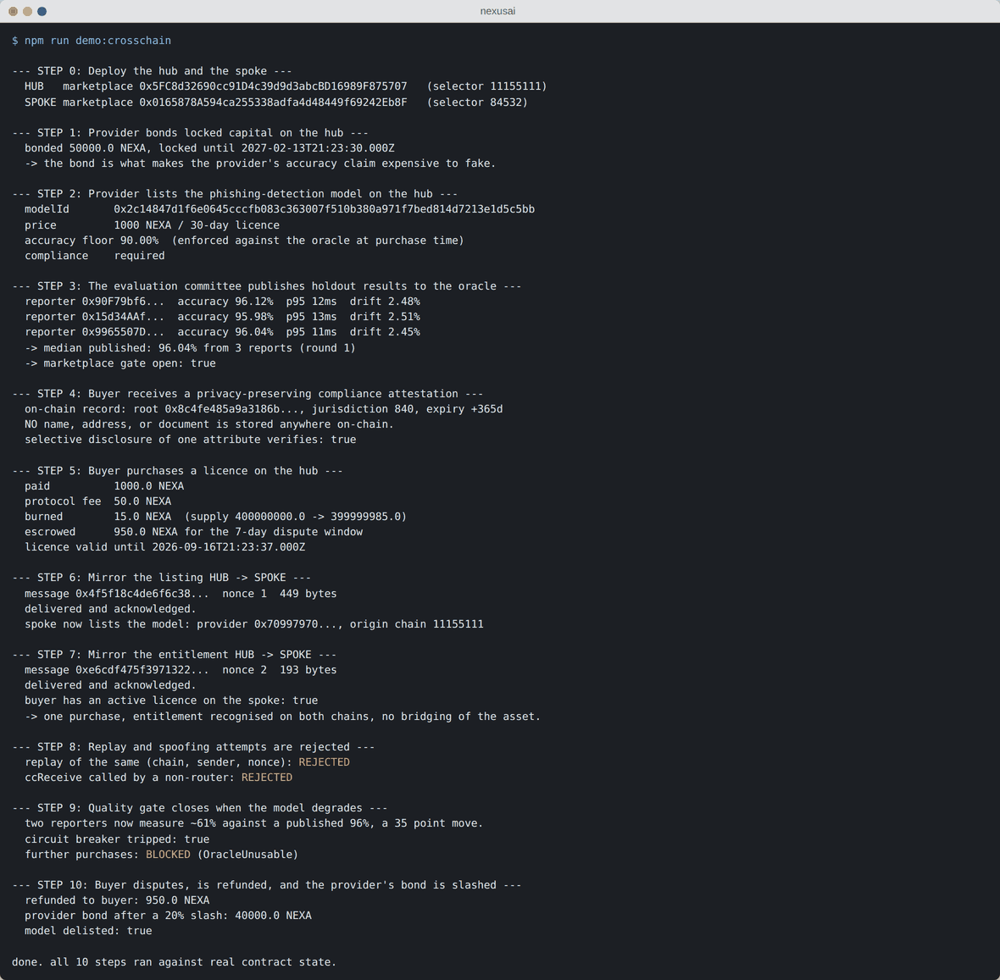
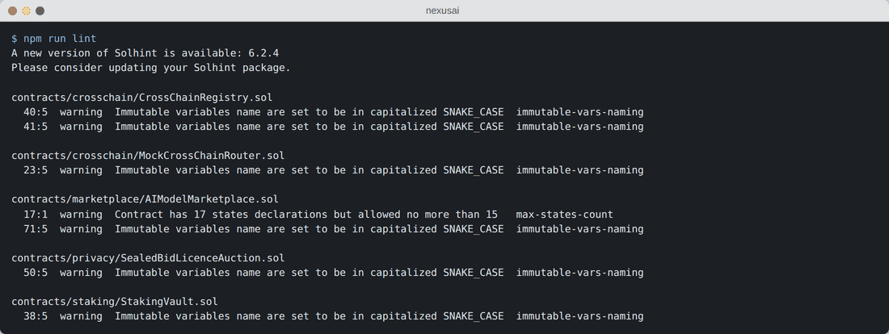

# NexusAI

Julian Calvo. AAI6850, Module 15 capstone. August 2026.

Repo: https://github.com/juliancalvoh-lab/nexusai

A multi-chain marketplace for AI model licences. A model can only be sold while
an oracle says it still hits the accuracy floor its provider promised. Buyers
prove they are allowed to buy without putting personal data on chain.

The model being sold is a phishing-detection classifier I built in `ml/`. Its
evaluation output is what the oracle publishes, so the ML side and the contract
side are actually wired together.

## Numbers

- 10 Solidity contracts, solc 0.8.24, OpenZeppelin 5.6
- 195 tests passing
- Coverage: 99.76% statements, 92.56% branches, 99.15% functions, 99.82% lines
- Slither 0.11.6: 45 results, all triaged. Solhint: 0 errors
- 13 security findings, 12 fixed
- Model test F1 0.960, on a synthetic corpus (see caveats)
- Networks configured: Sepolia (hub), Hoodi, Base Sepolia, Arbitrum Sepolia, Polygon Amoy

## Running it

```bash
npm install
npm run build        # compile
npm test             # 195 tests
npm run coverage     # writes coverage/index.html
npm run demo:crosschain
```

ML side (Python 3.11):

```bash
pip install -r ml/requirements.txt
npm run ml:all       # build dataset, train, evaluate. about 95 seconds
```

`ml/src/evaluate.py` writes `ml/reports/oracle_report.json` and
`scripts/report-oracle.js` pushes that file to the on-chain oracle.

You need Node 20+ and Python 3.11. Nothing above needs an API key or a funded
account, it all runs on the local Hardhat network.

Build note: `hardhat.config.js` uses the npm `solc@0.8.24` package instead of
letting Hardhat download a compiler, because the machine I built this on blocks
`binaries.soliditylang.org`. Set `USE_NATIVE_SOLC=true` if yours doesn't. Same
bytecode either way.

## What the demo does

`npm run demo:crosschain` deploys two full stacks in one EVM (a hub on the
Sepolia selector, a spoke on the Base Sepolia selector) and runs through:

1. Provider bonds 50,000 NEXA for 180 days
2. Provider lists the phishing model, 1,000 NEXA for a 30-day licence, 90% accuracy floor
3. Three reporters publish results, oracle takes the median (96.04%)
4. Buyer gets attested. Only a Merkle root and a country code go on chain
5. Buyer purchases. 15 NEXA burned, 35 to treasury, 950 escrowed for the dispute window
6. Listing mirrored hub to spoke
7. Entitlement mirrored hub to spoke
8. A replayed message and a direct `ccReceive` call both get rejected
9. Model drops to about 61%, circuit breaker trips, sales blocked
10. Buyer disputes, gets refunded, provider bond slashed 20%, model delisted

## Contracts

| Contract | What it does |
|---|---|
| NexusAIToken | ERC20, 1B cap, votes, burnable, per-epoch mint limit |
| StakingVault | 4 lock tiers (1.0x to 2.2x), Synthetix-style rewards, slashing |
| AIModelMarketplace | Listings, licences, escrow, disputes, fee split |
| AIPerformanceOracle | Median of N reporters, quorum, staleness, circuit breaker |
| ComplianceRegistry | Merkle attestations, jurisdiction blocks, revocation |
| SealedBidLicenceAuction | Commit-reveal auction for exclusive licences |
| CrossChainRegistry | Mirrors listings and entitlements between chains |
| MockCrossChainRouter | Stand-in bridge for local testing |
| NexusGovernor | 4% quorum, 1-day delay, 5-day vote |
| NexusTimelock | 2-day delay, holds every privileged role after handoff |

## Layout

```
contracts/   Solidity
test/        Hardhat tests
scripts/     preflight, deploy, demo, oracle push, governance handoff
ml/          phishing classifier: data, training, eval, reports
docs/        technical doc, business case, monitoring, diagrams, screenshots
audit/       security review and slither output
demo/        slides and demo script
pdf/         PDF versions of the docs
.github/     CI workflow
```

## Screenshots

Test suite:





Coverage report, from `npm run coverage`:



The cross-chain demo, end to end. `demo/crosschain_demo.mp4` is a 20-second
capture of the same run:



Linter:



Model plots are in `ml/reports/`: `roc_pr_curves.png`, `confusion_matrix.png`,
`feature_importance.png`. Architecture and sequence diagrams are in
`docs/diagrams/`.

## Deploying

```bash
cp .env.example .env       # RPC URLs and DEPLOYER_PRIVATE_KEY
npx hardhat run scripts/preflight.js --network sepolia      # check funds first
npm run deploy:sepolia     # hub
npx hardhat run scripts/preflight.js --network baseSepolia
npm run deploy:base        # spoke
npx hardhat run scripts/verify.js --network sepolia
DRY_RUN=true npx hardhat run scripts/governance-handoff.js --network sepolia
npx hardhat run scripts/governance-handoff.js --network sepolia
```

`preflight.js` sends nothing. It estimates the deploy gas against the live
network, multiplies by current gas price, and tells you whether the balance
covers it. On an L2 it widens the margin, because `estimateGas` returns L2
execution only and Base also bills an L1 data fee for the calldata.

On a spoke there is no Governor. If `SPOKE_PROPOSER` isn't set the handoff falls
back to the deployer and warns, because renouncing admin on a timelock with no
proposer would freeze that chain permanently. Point it at a multisig for
anything real.

After deploying, `node scripts/record-deployment.js` reads `deployments/*.json`
and writes `docs/DEPLOYMENT.md` with every address and transaction link, and
updates the caveats below. Pass `--repo=` and `--demo=` to include those too.

`deploy.js` leaves the deploying key holding admin roles so the wiring can be
finished. The deploy isn't done until `governance-handoff.js` has run and every
row of its check table says PASS. It moves all 19 privileged roles to the
Timelock, renounces the deployer's, and exits non-zero if any EOA still holds
one.

## Caveats

It's deployed on two public testnets. Hub on Ethereum Sepolia, spoke on
Ethereum Hoodi. I ran the cross-chain workflow across them, 14 transactions, and
the listing came out active on the spoke. Addresses and tx links are in
`docs/DEPLOYMENT.md`.

I also ran the governance handoff on the hub. 19 roles on the Timelock, deployer
holds none, Governor has `PROPOSER_ROLE`. I checked that against Sepolia myself
rather than trusting the script output.

The bridge adapter is operator-relayed for the demonstration. It is not
production CCIP or LayerZero transport, and `deploy.js` refuses to use it
unless `TESTNET_DEMO_ROUTER=true` is set explicitly.

The security report is my own review, not an independent audit. Eight residual
risks are still open, listed in section 4 of that report.

The ML corpus is synthetic. The build machine can't reach the public phishing
datasets, so `ml/data/build_dataset.py` generates 8,000 records from a seeded
RNG. The real loaders are written and get tried first. Expect much lower numbers
on real mail.

The business case models assumptions, not forecasts. Base-case NPV is only
positive because of terminal value. Strip that out and it is about -$2.8M over
the modelled horizon.

Generative AI was used on this project. See `pdf/AI_Usage_Disclosure.pdf`.

MIT licence.
